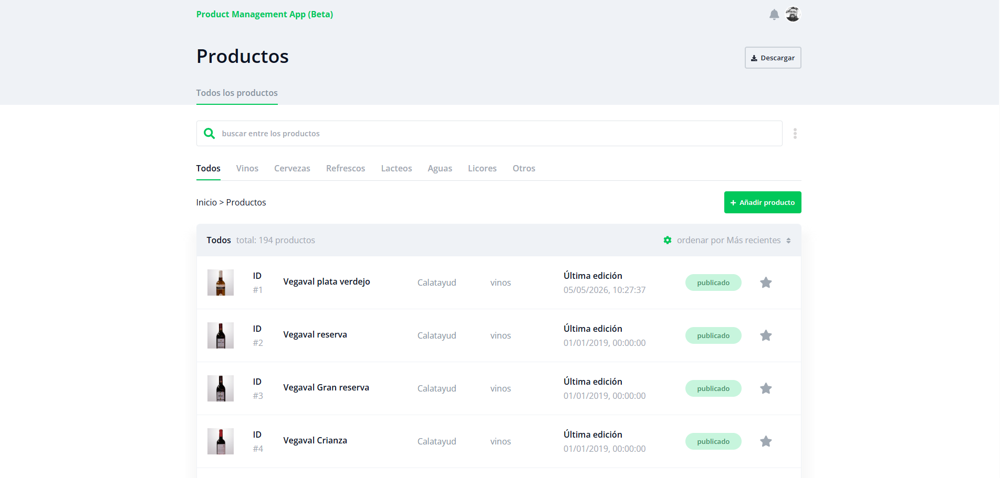

<div align="center">

# catalogue-management-app

[](https://catalogue-management-portal.netlify.app/) [](https://reactjs.org/) [](package.json)

**🗂️ Manage your product catalogue with full CRUD, instant search, and image uploads — all in one place 🚀**

[Live Demo](https://catalogue-management-portal.netlify.app/) · [Getting Started](#-getting-started) · [Tech Stack](#-tech-stack)

<br/>



</div>

---

## ✨ Features

- 📋 Browse all products in a sortable table
- 🔍 Real-time search and category filtering
- ➕ Add new products via modal form with optional image upload
- ✏️ Edit existing products on a dedicated page
- 🎬 Lottie animations for loading, success and error states
- 🔔 Toast notifications for user feedback

## 🛠️ Tech Stack

| Layer | Tech |
|-------|------|
| UI | React 17 |
| Routing | React Router DOM v5 |
| HTTP | Axios |
| Styles | SCSS |
| Animations | react-lottie |
| Notifications | React Toastify |
| Deployment | Netlify |

## 🚀 Getting Started

**1. Install dependencies**

```bash
npm install
```

**2. Set up environment**

Create a `.env` file at the project root:

```env
REACT_APP_API_URL=https://your-api.com/products
```

**3. Start the dev server**

```bash
npm start
```

Open [http://localhost:3000](http://localhost:3000) to view the app.

## 📜 Scripts

| Command | Description |
|---------|-------------|
| `npm start` | Start dev server on localhost:3000 |
| `npm run build` | Build for production |
| `npm test` | Run tests |
| `npm run sass` | Watch and compile SCSS |

## 🗺️ Routes

| Path | View |
|------|------|
| `/` | Products list |
| `/updateproduct/:id` | Edit product |

## 🌐 Live Demo

Try it live: [catalogue-management-portal.netlify.app](https://catalogue-management-portal.netlify.app/)
